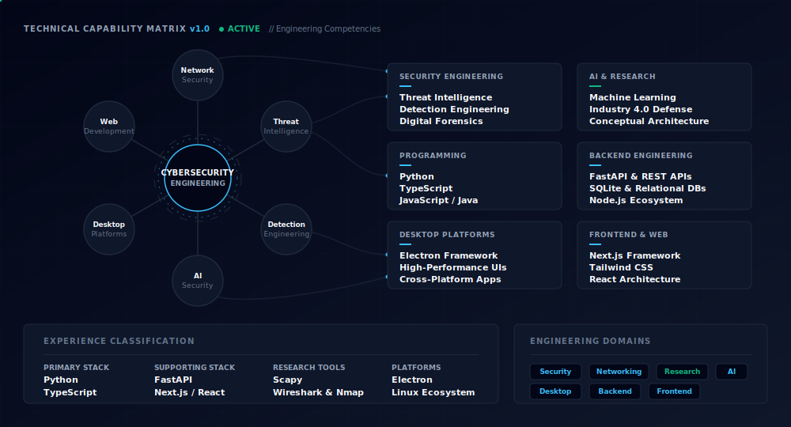
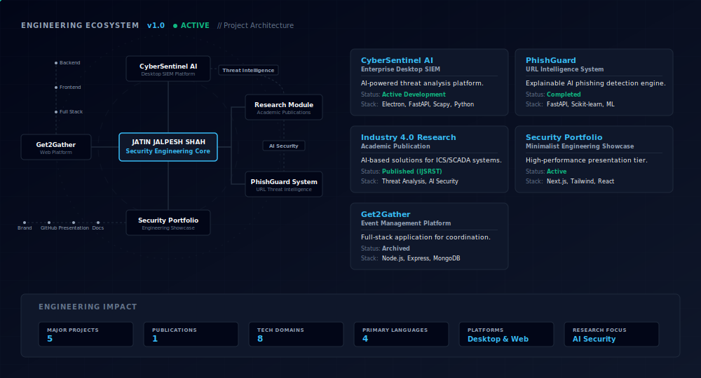
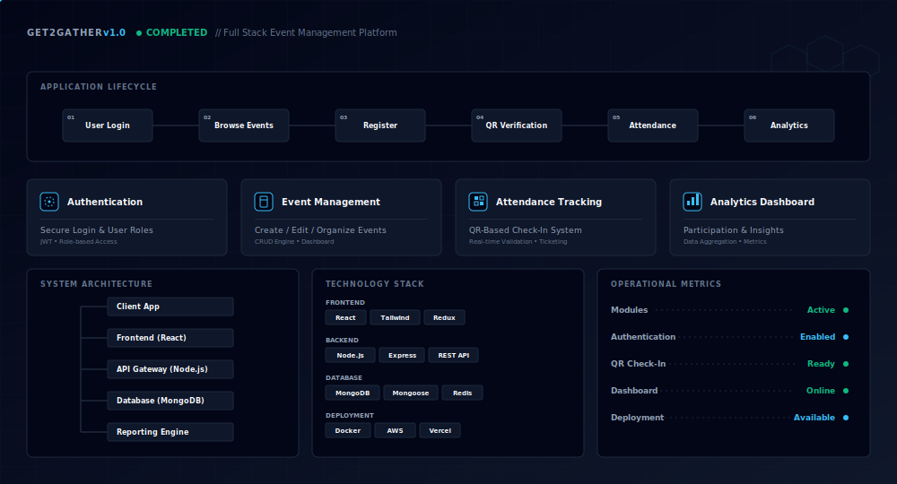
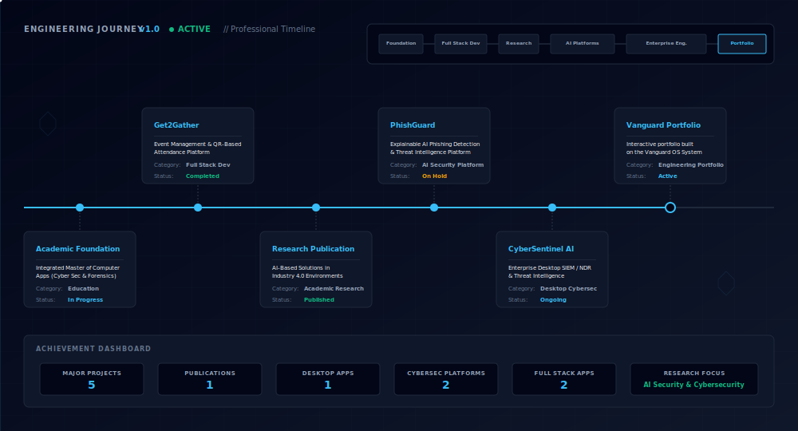

  

 

  <h1>Jatin Jalpesh Shah</h1>
  

    <b>Role:</b> Cybersecurity Engineer &nbsp;•&nbsp; AI Security Researcher 
    <b>Current Education:</b> Integrated Master of Computer Applications (Cyber Security & Forensics) 
    <b>Current Focus:</b> Enterprise Cybersecurity Platforms &nbsp;•&nbsp; AI Security &nbsp;•&nbsp; Security Research 
    <b>Open To:</b> Internships &nbsp;•&nbsp; Research Collaboration &nbsp;•&nbsp; Cybersecurity Engineering Opportunities
  

 

  

    <b>Location:</b> Vadodara, Gujarat, India &nbsp;|&nbsp;
    <b>Projects:</b> 4 &nbsp;|&nbsp;
    <b>Research Publications:</b> 1 &nbsp;|&nbsp;
    <b>Desktop Platforms:</b> 1 
    <b>Cybersecurity Platforms:</b> 2 &nbsp;|&nbsp;
    <b>Full Stack Applications:</b> 2 &nbsp;|&nbsp;
    <b>Current Flagship Project:</b> CyberSentinel AI 
    <b>Research Focus:</b> AI Security & Cybersecurity
  

 

---

 

  <b>
    <a href="#overview">🏠 Overview</a> &nbsp;•&nbsp;
    <a href="#cybersentinel-ai">🛡 CyberSentinel AI</a> &nbsp;•&nbsp;
    <a href="#phishguard">🎯 PhishGuard</a> &nbsp;•&nbsp;
    <a href="#research">📚 Research</a> &nbsp;•&nbsp;
    <a href="#technical-capability-matrix">⚙ Technical Capability Matrix</a>   
    <a href="#engineering-ecosystem">🌐 Engineering Ecosystem</a> &nbsp;•&nbsp;
    <a href="#get2gather">👥 Get2Gather</a> &nbsp;•&nbsp;
    <a href="#engineering-journey">🗺 Engineering Journey</a> &nbsp;•&nbsp;
    <a href="#github-analytics">📊 GitHub Analytics</a>   
    <a href="#publications">📄 Publications</a> &nbsp;•&nbsp;
    <a href="#certifications">🏆 Certifications</a> &nbsp;•&nbsp;
    <a href="#connect">🤝 Connect</a>
  </b>

 

---

 

## 🛡 CyberSentinel AI
**Enterprise Desktop SIEM & Threat Intelligence Platform**

A comprehensive desktop AI-powered SIEM/NDR platform engineered for deep network visibility and automated threat analysis. It integrates raw packet capture with machine learning models and live threat intelligence feeds to deliver an end-to-end detection and response workflow within a standalone, high-performance desktop architecture.

  

**Key Engineering Highlights:**
*   **Enterprise Traffic Visibility:** Real-time deep packet inspection and network flow monitoring infrastructure.
*   **Autonomous Threat Detection:** AI-assisted detection rules continuously correlating with live threat feeds.
*   **Centralized Security Operations:** Unified workspace for rapid incident triage, alert management, and automated response execution.

 

---

 

## 🎯 PhishGuard
**AI-Powered Phishing Detection & Threat Intelligence Platform**

An advanced URL intelligence system utilizing Explainable Threat Intelligence. PhishGuard analyzes URLs to detect malicious intent while providing transparent, human-readable explanations for its classification decisions, successfully bridging the gap between black-box AI models and actionable security operations.

  

**Key Engineering Highlights:**
*   **Explainable ML Classification:** Transparent, heuristic-based decision logic translating AI output into human-readable analysis.
*   **Layered URL Threat Intelligence:** Combining rule-based analysis, machine learning, brand spoof detection, blacklist verification, and threat intelligence sources to deliver comprehensive URL security assessment.
*   **Continuous Threat Correlation:** Active intelligence integration mapping local findings against established threat signatures.

 

---

 

## 📚 Research
**Cybersecurity Challenges and AI-Based Solutions in Industry 4.0 Environments**

An analysis of how the integration of digital networks with physical infrastructure in Industry 4.0 creates new vulnerabilities, and how artificial intelligence can securely monitor and defend these environments.

  

**Key Research Highlights:**
*   **ICS/SCADA Security:** Strategic frameworks for securing mission-critical industrial control systems against targeted disruptions.
*   **Cyber-Physical System Security:** Deploying intelligent, AI-Based Threat Detection for physical infrastructure environments.
*   **Industry 4.0 Risk Analysis:** Identifying and addressing sophisticated threat vectors and implementing AI-Based Security Solutions.

 

---

 

## ⚙ Technical Capability Matrix
**Enterprise-Grade Engineering & Security Competencies**

A detailed visualization of my core technical competencies, spanning threat intelligence, network monitoring, desktop platforms, and full-stack security analytics.

  

**Key Domain Highlights:**
*   **Applied Threat Intelligence:** Engineering methodologies utilizing Wireshark, Burp Suite, and Nmap for network dissection and vulnerability mapping.
*   **Full-Stack Security Engineering:** Scalable backend and frontend architecture development leveraging Node.js, FastAPI, Next.js, and React.
*   **AI Integration & Data Systems:** Implementing AI security protocols, model risk assessments, and robust data persistence.

 

---

 

## 🌐 Engineering Ecosystem
**Minimalist Portfolio & Platform Architecture**

A fast, responsive, and visually pristine platform engineered to display professional security work. It prioritizes clean UX and performance to effectively communicate research findings, engineering projects, and technical writing.

  

**Key Architectural Highlights:**
*   **Modular Component Design:** Scalable, strictly component-driven system architecture.
*   **Optimized Rendering Performance:** Engineered for lightning-fast speeds and ultra-responsive layout scaling.
*   **Vanguard OS Design System:** Powered exclusively by the Vanguard OS standard for guaranteed visual consistency across all modules.

 

---

 

## 👥 Get2Gather
**Integrated Event Management & QR-Based Platform**

An integrated Event Management & QR-Based Attendance Platform engineered as a demonstration of full-stack development capabilities, relational database management, and system design principles.

  

**Key Engineering Highlights:**
*   **End-to-End Application Architecture:** Full-stack orchestration from database persistence to client interface.
*   **Scalable Event Processing:** Reliable system design ensuring high-availability event tracking and user management.
*   **Automated Verification Systems:** Streamlined, QR-based processing pipelines for instantaneous attendance logging.

 

---

 

## 🗺 Engineering Journey
**Chronological Professional Roadmap**

A precise timeline of my professional evolution, tracking my journey from core academic foundations through the architectural development of enterprise security platforms.

  

**Key Evolution Highlights:**
*   **Rigorous Academic Foundation:** Focused cybersecurity studies via the Integrated Master of Computer Applications (IMCA) program.
*   **Security Platform Engineering:** End-to-end design and deployment of CyberSentinel AI, PhishGuard, and Get2Gather.
*   **Current Engineering Focus:** Enterprise Detection Engineering, AI Security, Threat Intelligence, and Security Research.

 

---

 

## 📊 GitHub Analytics
**Open Source Activity & Code Contributions**

Real-time telemetry of my open-source engineering ecosystem.

  
  
    
  
    
  
    
  

 

---

 

## 📄 Publications
**Verified Academic Research & Scientific Contributions**

Detailed overview of my published scientific work in the cybersecurity domain.

*   **Paper Title:** Cybersecurity Challenges and AI-Based Solutions in Industry 4.0 Environments
*   **Journal:** International Journal of Scientific Research in Science and Technology (IJSRST)
*   **Publication Date:** 07 March 2026
*   **Research Domain:** ICS/SCADA Security & Artificial Intelligence
*   **Short Summary:** An analysis of how the integration of digital networks with physical infrastructure in Industry 4.0 creates new vulnerabilities, and how artificial intelligence can securely monitor and defend these environments against cyber-physical attacks.
*   **DOI / Publication Link:** [10.32628/IJSRST2613948](https://ijsrst.com/IJSRST2613948)

 

---

 

## 🏆 Certifications
**Verified Professional Credentials & Training**

A curated selection of my strongest professional credentials. Additional certifications are available in my complete credential portfolio.

**Cybersecurity**
*   Cisco Ethical Hacker
*   Cisco Network Defense
*   Cisco Endpoint Security

**Information Security**
*   ISO/IEC 27001:2022 Information Security Associate

**Programming**
*   Cisco Python Essentials 1
*   NPTEL Data Structures & Algorithms

**Professional Training**
*   ISC² CC Training *(Training only)*

 

---

 

## 🤝 Connect
**Professional Networking & Research Collaboration**

Open to:
*   Cybersecurity Internships
*   AI Security Research
*   Detection Engineering
*   Threat Intelligence
*   Open Source Security Projects

   
  <b>
    <a href="https://jatinjalpeshshah.github.io">Portfolio</a> &nbsp;•&nbsp;
    <a href="https://github.com/jatinjalpeshshah">GitHub</a> &nbsp;•&nbsp;
    <a href="https://www.linkedin.com/in/jatinjalpeshshah/">LinkedIn</a> &nbsp;•&nbsp;
    <a href="https://ijsrst.com/IJSRST2613948">Research Publication</a> &nbsp;•&nbsp;
    <a href="./docs/Jatin_Jalpesh_Shah_Resume.pdf">Resume</a> &nbsp;•&nbsp;
    <a href="mailto:224jatin2006@gmail.com">Email</a>
  </b>
    

 

---

 

  
Designed & Engineered by

  <h3>Jatin Jalpesh Shah</h3>
  
<b>Cybersecurity Engineer • AI Security Researcher</b>

  
Research • Security Engineering • Artificial Intelligence

  
<i>Built using the Vanguard OS Design System</i>

